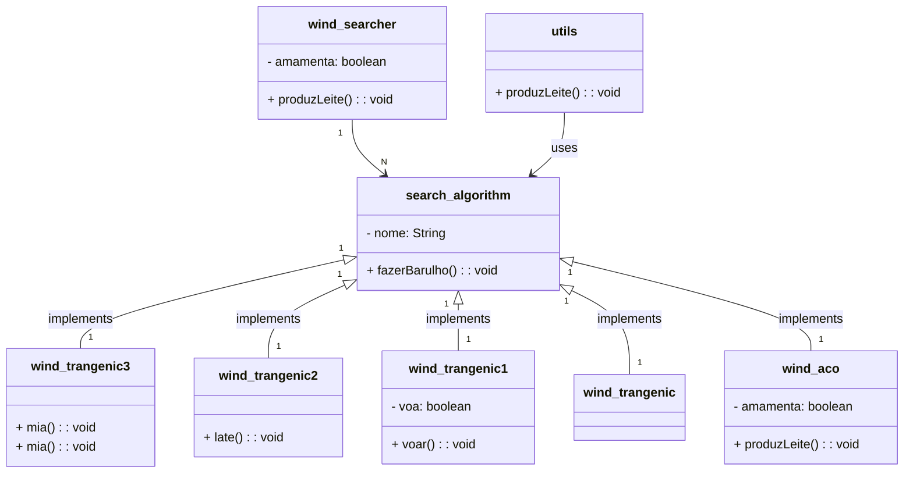

## UML‍ 💬:

Heres the UML that represents how the application works with their classes.

```mermaid
classDiagram

  class search_algorithm {
    - nome: String
    + fazerBarulho(): void
  }

  class wind_aco {
    - amamenta: boolean
    + produzLeite(): void
  }

  class wind_trangenic1{
    - voa: boolean
    + voar(): void
  }

  class wind_trangenic2{
    + late(): void
  }

  class wind_trangenic3{
    + mia(): void
  }

  class wind_trangenic3{
    + mia(): void
  }

  class wind_searcher {
    - amamenta: boolean
    + produzLeite(): void
  }

  class utils {
    + produzLeite(): void
  }

  search_algorithm "1" <|-- "1" wind_trangenic3: implements
  search_algorithm "1" <|-- "1" wind_trangenic2: implements 
  search_algorithm "1" <|-- "1" wind_trangenic1: implements
  search_algorithm "1" <|-- "1" wind_trangenic: implements
  search_algorithm "1" <|-- "1" wind_aco: implements
  wind_searcher "1" --> "N" search_algorithm:  
  utils --> search_algorithm: uses
```

## Classes 🎒:

## Relations 🎒: