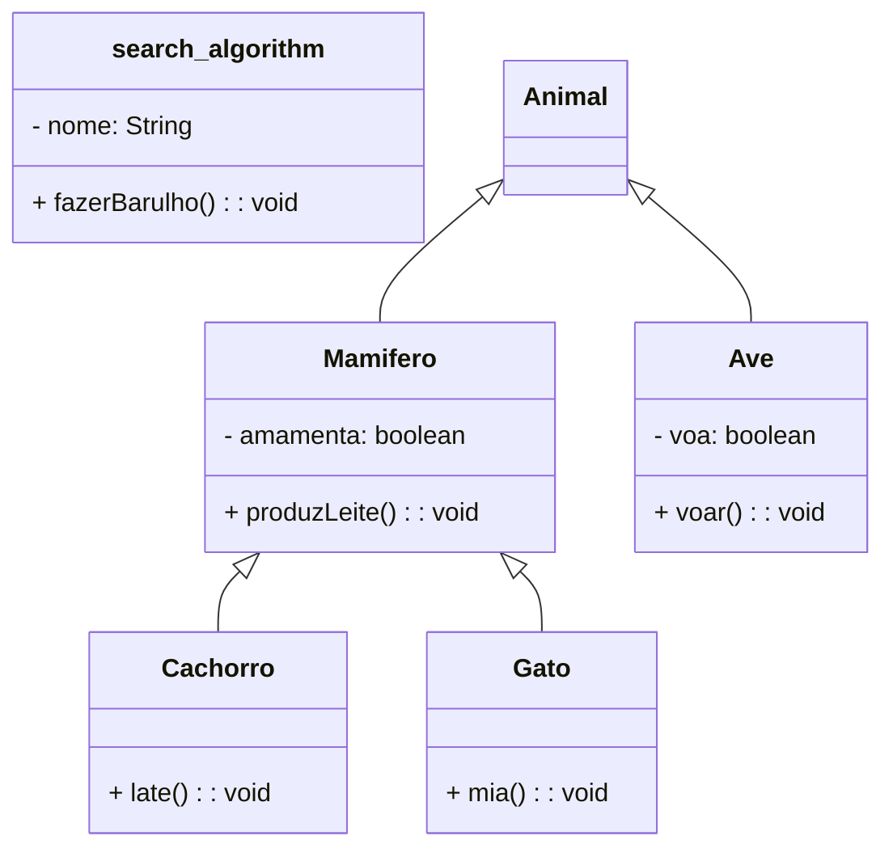

## UML‍ 💬:

Heres the UML that represents how the application works with their classes.

```mermaid
classDiagram


  class search_algorithm {
    - nome: String
    + fazerBarulho(): void
  }

  class Mamifero {
    - amamenta: boolean
    + produzLeite(): void
  }

  class Ave {
    - voa: boolean
    + voar(): void
  }

  class Cachorro {
    + late(): void
  }

  class Gato {
    + mia(): void
  }

  Animal <|-- Mamifero
  Animal <|-- Ave
  Mamifero <|-- Cachorro
  Mamifero <|-- Gato
```

<h4 align="center">Figure 2 - <app_name> UML.</h4>