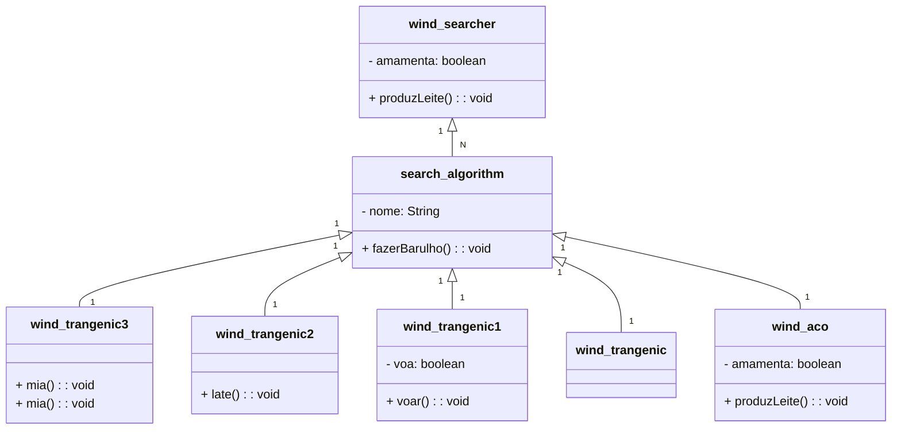

## UML‍ 💬:

Heres the UML that represents how the application works with their classes.

```mermaid
classDiagram

  class search_algorithm {
    - nome: String
    + fazerBarulho(): void
  }

  class wind_aco {
    - amamenta: boolean
    + produzLeite(): void
  }

  class wind_trangenic1{
    - voa: boolean
    + voar(): void
  }

  class wind_trangenic2{
    + late(): void
  }

  class wind_trangenic3{
    + mia(): void
  }

  class wind_trangenic3{
    + mia(): void
  }

  class wind_searcher {
    - amamenta: boolean
    + produzLeite(): void
  }

  search_algorithm "1" <|-- "1" wind_trangenic3
  search_algorithm "1" <|-- "1" wind_trangenic2
  search_algorithm "1" <|-- "1" wind_trangenic1
  search_algorithm "1" <|-- "1" wind_trangenic
  search_algorithm "1" <|-- "1" wind_aco
  wind_searcher "1" <|-- "N" search_algorithm
```

## Classes üéí:

## Relations üéí: